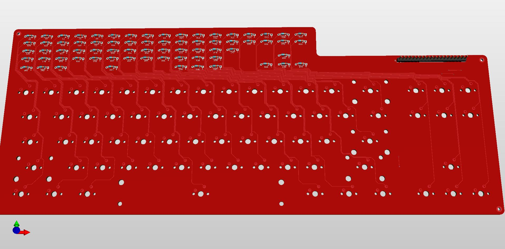

# Protomatrix
A Keyboard matrix PCB for prototyping new keyboard ideas.

The concept of this project is to create keyboard prototyping PCB.
This a very simple matrix that includes diodes only. Each trace ends 
in a pinout that can be connected to a breadboard. 
This first version is set up as a FRL/TKL. I wanted enough keys for
things to feel complete, and still work on a Pro-Micro. Of Course
this is meant to work with any prototyping system, but Pro-Micros
are cheap.

As of right now this PCB is untested. I am awaiting prototypes and I will update this when i have tested them. 

